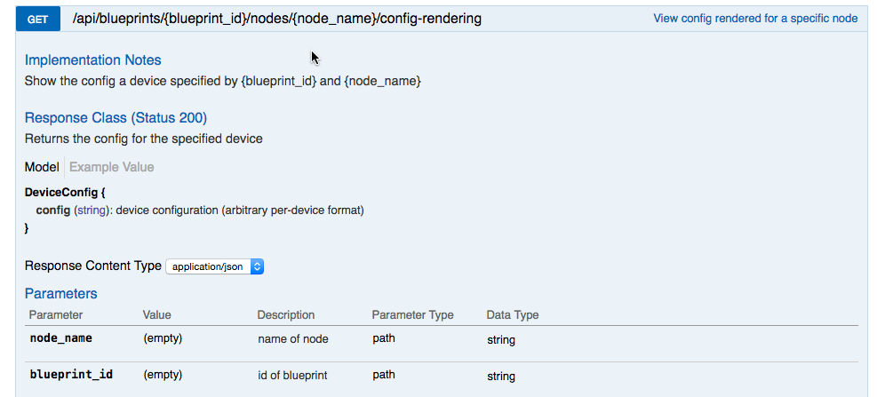
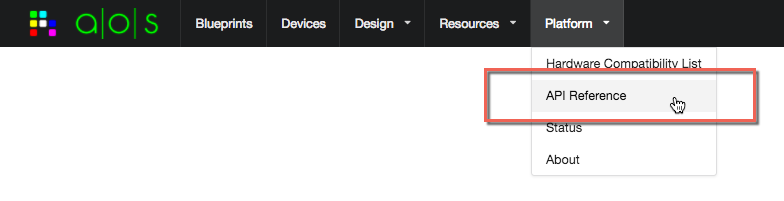

.. _blueprints:

Blueprints
==========

A Blueprint is a specific instance of an engineering Design Template that you build, deploy, and operate within your
network.  A typical use-case is the following:

   1. create a blueprint from a given design template
   2. build out the blueprint with specific parameter values
   3. assign specific devices to the blueprint
   4. deploy the blueprint onto the devices
   5. obtain operational values about the blueprint

This version of the aos-pyez library focuses the "build" aspects; meaning you can use the library to create a
Blueprint from a design Template and provision the Blueprint parameters.  Future versions of the aos-pyez library
will expose the complete set of functionality.  You can access all of the Blueprint functionality using the method
described in the section :ref:`session_requests`.

You can access the Blueprints via the aos-pyez library by using the :attr:`Blueprints` property of the
Session: ::

    >>> aos.Blueprints

Create a Blueprint from a Design Template
-----------------------------------------
Let's create a Blueprint from a design Template called "My-Demo-Design".  We can verify that you've created this
template using the :attr:`DesignTemplates` Session property: ::

    >>> aos.DesignTemplates
    {
       "url": "design/templates",
       "by_id": "id",
       "item-names": [
          "My-Demo-Design",
          "vPOD-L3"
       ],
       "by_label": "display_name"
    }

To create a Blueprint, you must have the design Template **id** value, along with the name of the design reference
architecture.  For this example, the reference architecture is called *two_stage_l3clos*: ::

    >>> template = aos.DesignTemplates['My-Demo-Design']
    >>> template.id
    u'ee0164ed-d9cf-46c8-a5e5-8b16d70d0a1c'

Let's create a Blueprint called "My-Pod-A" from this design.  The first step is to create a blueprint item using the
collection: ::

    >>> blueprint = aos.Blueprints['My-POD-A']
    >>> blueprint.exists
    False

We can see that AOS-Server does not yet know about this Bluerpint because the :attr:`exists` property is `False`. The
next step is to perform the create action: ::

    >>> blueprint.create(template.id, reference_arch='two_stage_l3clos')
    True
    >>> blueprint.exists
    True
    >>> blueprint.id
    u'a58e8c3f-84c5-472c-aaf8-a2292f4aa2c6'

At this point the blueprint exists in the AOS-Server, and you can verify that via the UI, for example:

Assign Blueprint Parameters
---------------------------
Once you have created a Blueprint, you will need to assign values that are specific to this service.  These values
include, for example, the IP addresses, VLANs, ASNs, specific device-models to use, and ultimately specific devices.
You will need to provide all blueprint values before you can actually deploy the blueprint to the devices.

You can assign blueprint values using the designated *slots* defined by the design Template.  You can get a list
of the known slots using the :attr:`params.names` list.  For example: ::

    >>> print json.dumps(blueprint.params.names, indent=2)
    [
      "external_router_interfaces",
      "leaf_loopback_ips",
      "spine_leaf_link_ips",
      "to_external_router_link_ips",
      "leaf_asns",
      "node_leaf_1_interfaces",
      "hcls",
      "devices",
      "node_spine_1_interfaces",
      "spine_loopback_ips",
      "deploy",
      "spine_asns",
      "dhcp_server_ip",
      "logical_device_maps",
      "resource_pools",
      "node_leaf_3_interfaces",
      "node_leaf_2_interfaces",
      "hostnames",
      "external_links",
      "node_spine_2_interfaces",
      "port_maps"
    ]

You can inspect the purpose and current value of a blueprint parameter by accessing it as a collection item.  For
example, let's look at a commonly used slot called *resource_pools*.  This parameter is where you would assign the
specific IP-Pools and ASN-Pools for this blueprint. ::

    >>> param = blueprint.params['resource_pools']
    >>> param
    {
       "Blueprint Name": "My-POD-A",
       "Blueprint ID": "a58e8c3f-84c5-472c-aaf8-a2292f4aa2c6",
       "Parameter Name": "resource_pools",
       "Parameter Value": {},
       "Parameter Info": {
          "slot_type": "POOL_LIST",
          "name": "resource_pools",
          "ids": [
             "leaf_loopback_ips",
             "spine_leaf_link_ips",
             "to_external_router_link_ips",
             "leaf_asns",
             "spine_loopback_ips",
             "spine_asns",
             "virtual_network_svi_subnets"
          ]
       }
    }

The **resource_pool** is one of the more complicated, but most often used, values.  So it's worthwhile to explore
this one in detail here.  You can see from the "Parameter Info" description that the *resource_pools* slot has a
number of sub-parameters, *leaf_asns* for example.  This means that if you want to assign the ASN-Pool for the leaf
switches, you would store that value there.  Looking at the "Parameter Value" area, you can see that no values are
actually assigned to the *resource_pools* slot.  So let's assign the ASN pool called "Private-ASN-pool": ::

    >>> aos.AsnPools['Private-ASN-pool'].id
    u'b4fdb577-531b-40ba-96a8-9a015794b30c'

From the "slot_type" information we can see the value must actually be a **list**.  So in order to update one
specific slot in the **resource_pools** you would need to do something like this: ::

    >>> param.update({'leaf_asns': [aos.AsnPools['Private-ASN-pool'].id]})

You can see :meth:`update` takes a value to merge into the slot, and that value is a dictionary keyed by the slot ids
.  In this case we are only updating a single key, **leaf_asns**.  The value for this key must be a **list** of
ASN-Pool IDs.  In this case, we are only assigning a single pool, so a list of one element.  Once this action is
completed, you can verify this by examining the param :attr:`value` property: ::

    >>> param.value
    {u'leaf_asns': [u'b4fdb577-531b-40ba-96a8-9a015794b30c']}

You can also see this update on the AOS-Server UI, for example:

Let's look at one more example, this one much less complex.  This blueprint has a DHCP relay service component, and
one of the blueprint parameters is to provide the DHCP server IP address.  The slot name here is: ::

    >>> blueprint.params['dhcp_server_ip']
    {
       "Blueprint Name": "My-POD-A",
       "Blueprint ID": "a58e8c3f-84c5-472c-aaf8-a2292f4aa2c6",
       "Parameter Name": "dhcp_server_ip",
       "Parameter Value": {},
       "Parameter Info": {
          "slot_type": "IP",
          "name": "dhcp_server_ip",
          "ids": [
             "value"
          ]
       }
    }

So in order to assign this value, we would need to perform a parameter update, the key is **value** and we need to
provide the IP address. We could do this update in a simple line, for example: ::

    >>> blueprint.params['dhcp_server_ip'].update({'value': "192.168.59.254"})

And reading this back, we can see the update is completed as reflected in the "Parameter Value": ::

    >>> blueprint.params['dhcp_server_ip']
    {
       "Blueprint Name": "My-POD-A",
       "Blueprint ID": "a58e8c3f-84c5-472c-aaf8-a2292f4aa2c6",
       "Parameter Name": "dhcp_server_ip",
       "Parameter Value": {
          "value": "192.168.59.254"
       },
       "Parameter Info": {
          "slot_type": "IP",
          "name": "dhcp_server_ip",
          "ids": [
             "value"
          ]
       }
    }

or more simply by examining just the :attr:`value` property: ::

    >>> blueprint.params['dhcp_server_ip'].value
    {u'value': u'192.168.59.254'}

For more details on using the aos-pyez API with Blueprints, see :ref:`api_blueprints`.

Retrieve Blueprint Build Status
-------------------------------
You can check to see if the blueprint has any missing build values by examinging the :attr:`build_errors` property.
This property is a list of current missing build issues, or `None` if there are no build issues.  Here is a short
listing of the system related issues for a new blueprint, for example: ::

    >>> print json.dumps(blueprint.build_errors['system']['nodes'], indent=2)
    {
      "leaf_3": {
        "hcl_id": "Value should be set",
        "port_map": "Value should be set",
        "loopback_ip": "Value should be set"
      },
      "leaf_2": {
        "hcl_id": "Value should be set",
        "port_map": "Value should be set",
        "loopback_ip": "Value should be set"
      },
      "leaf_1": {
        "hcl_id": "Value should be set",
        "loopback_ip": "Value should be set",
        "port_map": "Value should be set"
      },
      "spine_2": {
        "hcl_id": "Value should be set",
        "loopback_ip": "Value should be set",
        "port_map": "Value should be set",
        "asn": "Value should be set"
      },
      "spine_1": {
        "hcl_id": "Value should be set",
        "loopback_ip": "Value should be set",
        "port_map": "Value should be set",
        "asn": "Value should be set"
      }
    }

Retrieve Blueprint Build Contents
---------------------------------
You can retrieve the contents of the Blueprint build composition at any time using the :attr:`contents` property.
This property will give you a very large dictionary of data organized in a way that is specific to the design
Template.  The following is a short snippet of content values for the "links" area: ::

    # each time you access the contents property the library will do a new GET.
    # so make a variable so we only do a single GET for this example.

    >>> contents = blueprint.contents

    # examine a list of all the items in the contents

    >>> print json.dumps(contents.keys(), indent=2)
    [
      "display_name",
      "reference_architecture",
      "service",
      "created_at",
      "custom_extension",
      "system",
      "last_modified_at",
      "intent",
      "tenant_connectivity",
      "external_endpoints",
      "id",
      "constraints"
    ]

    # access the system links contents.  There are 23 links in this Blueprint

    >>> links = contents['system']['links']
    >>> len(links)
    23

    # now show the contents of one of the links

    >>> print json.dumps(links[0], indent=2)
    {
      "role": "leaf_l3_server",
      "endpoints": [
        {
          "interface": "eth0",
          "display_name": "server_4_leaf_2",
          "type": "l3_server",
          "id": "server_4_leaf_2",
          "ip": "172.21.0.17/31"
        },
        {
          "interface": "swp4",
          "display_name": "leaf_2",
          "type": "leaf",
          "id": "leaf_2",
          "ip": "172.21.0.16/31"
        }
      ],
      "display_name": "leaf_2<->server_4_leaf_2"
    }

Retrieve Device Rendered Configurations
---------------------------------------
Once you've completed the build out of the Blueprint parameters, you can retrieve the actual equipment vendor
specific configuration that AOS will deploy onto the device.  The structure and format of the device configuration
will be specific to the equipment+NOS.  The following example is part of the configuration for an Arista EOS device.
In this example, the "spine_1" device happens to be an Arista.  The aos-pyez library does not a convenient method to
retrieve the configuration, so we need to use the :ref:`session_requests` technique.  The AOS-Server API reference
page for the required request is:

And the code example to invoke this API for the "spine_1" node: ::

    >>> got = blueprint.api.requests.get("%s/nodes/spine_1/config-rendering" % blueprint.url)
    >>> body = got.json()
    >>> body.keys()
    [u'config']
    >>>
    >>> print body['config']
    service interface inactive expose
    !
    hostname spine-1
    interface Ethernet1
      description facing_router-A:
      no switchport
      ip address 1.1.1.0/31
      no shutdown
      exit
    !
    interface Ethernet2
      description facing_leaf_1:swp6
      no switchport
      ip address 172.20.0.0/31
      no shutdown
      exit
    !
    # ... clipped ...

More Features Soon!
-------------------
Much of the Blueprint functionality from a *deploy* and *operate* phase is not currently exposed via the aos-pyez.
Stay tuned for more enhancements in the coming releases.  If you have any particular interests, please open a github
issue.  In the meantime, you can use the :ref:`session_requests` technique illustrated above.  You can find all of
the AOS-Server API information directly from the UI:

