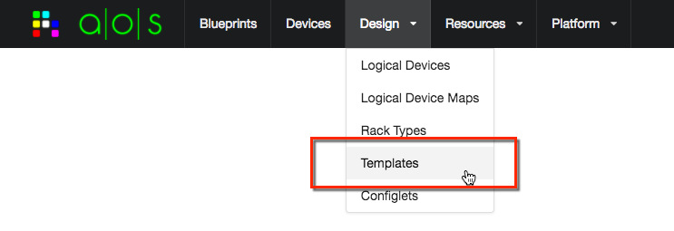
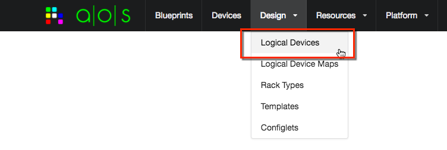
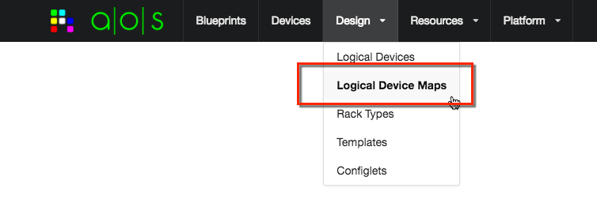
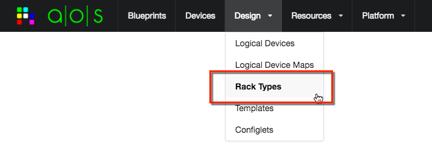

.. _design:

===============
Design Elements
===============

Design elements are used when creating network service designs, called *Templates*.  These templates are then used as
a basis for specific instances of managed network services called *Blueprints*.  For details on managing Blueprints,
refer to the guide document :ref:`blueprints`.  This guide page is meant to provide information on using the AOS
design elements via the aos-pyez library.  For complete documentation on these topics please refer to the AOS product
documentation available via the `support portal <https://support.apstra.com/support/login>`_.

This version of the aos-pyez supports all AOS 1.1 managed design elements:

    * Design Templates
    * Logical Devices
    * Logical Device Maps
    * Rack Types

For this version of aos-pyez you are able to manage design elements as a collection, as described in the
:ref:`collections` guide pages.  As a practical matter, you would use the AOS-Server UI to create these elements.  You
can then use the aos-pyez library to use the Template designs as part of building a Blueprint.
Alternatively you could use the aos-pyez library to load the item contents from saved JSON files and create them in
the AOS-Server.

.. _design_template:

Design Templates
----------------
When you create a design template you are instructing AOS on how to compose a network service in a vendor agnostic
manner - meaning the design itself does not include any network vendor hardware or network operating system specific
requirements.  You assign those details later when you build out a Blueprint based on the design template.

For example, a design Template may describe a two stage L3 Clos data center fabric that uses 32x40 GE spine-switches
.  The design itself is vendor agnostic as it constrains the design to specific device property (32x40GE) but not
to a specific network equipment vendor or network operating system (NOS). When you create a Blueprint from a
Template, you can then assign into that Blueprint any specific vendor that provides for such a switch.  You create
these design / build relationships using the other design elements such as Logical Devices, Logical Device Maps, and
Rack Types.

You can access the design Templates via the aos-pyez library by using the :attr:`DesignTemplates` property of the
Session: ::

    >>> aos.DesignTemplates

Logical Devices
---------------
You use a Logical Device as a design element for a :ref:`design_template` or :ref:`rack_type`.
You use Logical Devices to define the device properties that will then be used as part of a design.  A logical
device design construct is vendor agnostic, meaning that the properties defined are not speciifc to any one
network equipment vendor or NOS.

Broadly speaking, these properties include the following:

    * Number of ports - ports can also be arranged into groups
    * Speed of ports - 10GE, 40GE, 100GE
    * Role of ports - connects leaf to spine, connect to external-router, to-attached server, etc.

A typical example of a logical device is a a leaf switch with 48x10GE + 6x40GE ports.  The 48x10GE could be
designated to connect to either servers or external-routers (for the case of 10GE router connections).  The 6x40GE
ports would be designated as connecting leaf to spine, i.e. L3 Clos fabric ports.

You can access the Logical Devices via the aos-pyez library by using the :attr:`LogicalDevices` property of the
Session: ::

    >>> aos.LogicalDevices

.. _logical_device_maps:

Logical Device Maps
-------------------
You use a Logical Device Map to create the relationship between a Logical Device (vendor agnostic) and a specific
network vendor equipment running a specific NOS.  You then use logical device maps when building a Blueprint
to identify the specific network equipment to use.

For example, you might have a design that requires a 32x40GE spine, as defined by a logical device.  You would then
need to create a logical device map for the specific equipment you plan to use. If you want to use a Dell S-6000
switch running Cumulus Linux, you would create a specific logical device map for that purpose.  Likewise, if you
wanted to use a Cisco 9332 running NX-OS you would create another logical device for that purpose. Once you have
logical device maps created, you can then use these to associate specific vendor equipment into a Blueprint.

You can access the Logical Device Maps via the aos-pyez library by using the :attr:`LogicalDeviceMaps` property of the
Session: ::

    >>> aos.LogicalDeviceMaps

.. _rack_type:

Rack Types
----------
You use Rack Types as an element of a design Template.  You can compose the structure of rack that includes
the following properties:

    * Number of leaf-switches per rack
    * Logical Device type of leaf-switches
    * Number of links between leaf-switches within the rack (for redundancy)
    * Number of links between leaf-switches and spine-switches
    * Number of servers within the rack
    * Logical Device type of servers (modeling the number NICs)
    * The manner in which the server NICs are connected between rack leaf-switches

You can access the Logical Device Maps via the aos-pyez library by using the :attr:`RackTypes` property of the
Session: ::

    >>> aos.RackTypes
