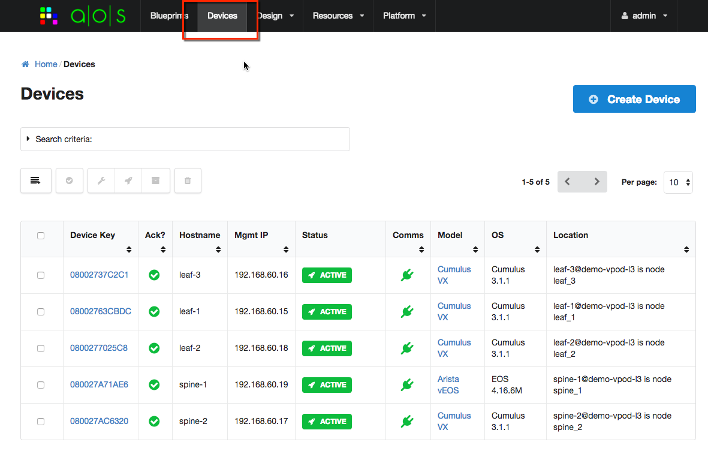
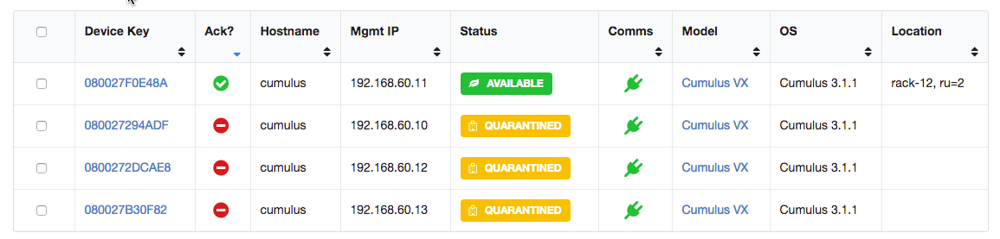

.. _devices:

=======
Devices
=======

You can see all devices under AOS management from the Devices UI:

For this version of aos-pyez you are able to manage devices as a collection, as described in the
:ref:`collections` guide pages.  You can access the devices by using the :attr:`Devices` property of the

Session: ::

    >>> aos.Devices

You can select a specific device from the collection by using the *device-key* as shown in the UI.  The device-key
is generally the serial-number of the device.

If you are using the python interactive interpreter, you can see a list of all known device-keys, for example: ::

    >>> aos.Devices
    {
       "url": "systems",
       "by_id": "id",
       "item-names": [
          "08002737C2C1",
          "080027A71AE6",
          "0800277025C8",
          "080027AC6320",
          "08002763CBDC"
       ],
       "by_label": "device_key"
    }

And in the above, you can see that the `label` used to index the collection is the `device_key` collection item
property.

Available Device Information
----------------------------
AOS collects information about each device under management.  Some of this information is speciifc to AOS, for
example the version of the AOS device agent.  Some of this information is specific to the device, such as
serial-number, hardware-model, vendor, OS version, etc.  If you are using the python interactive interpreter, you can
see all available information, for example: ::

    >>> dev = aos.Devices['08002737C2C1']
    >>> dev
    {
       "name": "08002737C2C1",
       "value": {
          "device_key": "08002737C2C1",
          "facts": {
             "hw_version": "",
             "mgmt_ifname": "eth0",
             "mgmt_macaddr": "08:00:27:37:c2:c1",
             "os_version_info": {
                "major": "3",
                "build": "1",
                "minor": "1"
             },
             "aos_hcl_model": "Cumulus_VX",
             "serial_number": "08002737C2C1",
             "os_arch": "x86_64",
             "vendor": "Cumulus",
             "os_version": "3.1.1",
             "os_family": "Cumulus",
             "hw_model": "VX",
             "aos_server": "192.168.59.250",
             "aos_version": "AOS_1.1.0_OB.11",
             "mgmt_ipaddr": "192.168.60.16"
          },
          "status": {
             "hostname": "leaf-3",
             "blueprint_id": "30cd9032-35f2-4532-8543-dc24fc8ec7cd",
             "blueprint_active": true,
             "error_message": "",
             "device_start_time": "2017-02-09T21:52:58.606303Z",
             "domain_name": "",
             "pool_id": "default_pool",
             "fqdn": "leaf-3",
             "comm_state": "on",
             "agent_start_time": "2017-02-09T21:53:14.000000Z",
             "state": "IS-ACTIVE",
             "is_acknowledged": true
          },
          "id": "MDgwMDI3MzdDMkMx",
          "user_config": {
             "aos_hcl_model": "Cumulus_VX",
             "admin_state": "normal",
             "location": "leaf-3@demo-vpod-l3 is node leaf_3"
          }
       },
       "id": "MDgwMDI3MzdDMkMx"
    }

You can also access the :attr:`value` property directly, for example: ::

    >>> print "S/N: {}".format(dev.value['facts']['serial_number'])
    S/N: 08002737C2C1

Device Item Properties
----------------------
The aos-pyez library provides the following device item properties as a convenience:

    * `state` - provides the status/state value
    * `is_approved` - `True` if the device is approved for use, `False` otherwise
    * `user_config` - provide acess to the user_config dictionary

Approving Devices for Use
-------------------------
When a device initially registers with the AOS-Server (via the AOS device agent), the AOS-Server will place it into a
Quarantined state.  You are then required to approve it for use.  Alternatively the you can pre-provision the
AOS-Server with information so that a device will be recognized upon initial registration, skipping the approval step.

You can approve a given device via the aos-pyez library using the device instannce :meth:`approve` method.  This method
takes an optional `location` parameter - this is an arbitrary string value you can use to
identify where this device is located in the network, e.g. "rack-12, rack-unit-19".  For more details on this API
refer to :ref:`api_devices`.  Example: ::

    >>> dev = aos.Devices['080027F0E48A']
    >>> dev.is_approved
    False
    >>> dev.approve(location='rack-12, ru=2')
    True
    >>> dev.is_approved
    True

After a device is approved, you can see the results on the AOS-Server UI, for example:

